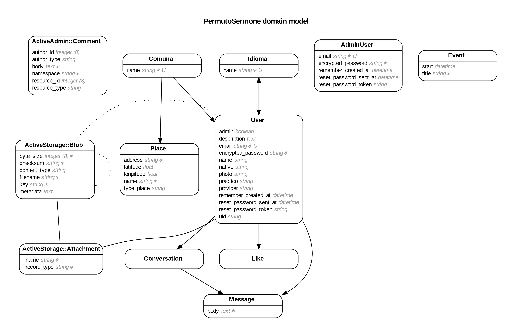

# README

#Permuto_sermone
proyecto para intercambiar de idiomas en lugares cercanos

 El proyecto es un ejemplo de aplicación web construida con Ruby on Rails 5.2.3 y base de datos Postgresql

El tablero Trello y las historias de usuario estas disponible en el link
https://trello.com/b/5W1J0Z47/permutosermone

heroku
https://blooming-escarpment-96922.herokuapp.com/

antes de trabajar
bundle install
yarn install
rails db:migrate
rails db:seed

el modelo fisico muestra los principales cardiales y tablas de app

![] [modelo fisico]

los mokup miestran pantallas  principales de app
 ![] [mokup]
 

El tablero Trello y las historias de usuario estas disponible en el link
https://trello.com/b/5W1J0Z47/permutosermone

heroku
https://blooming-escarpment-96922.herokuapp.com/
